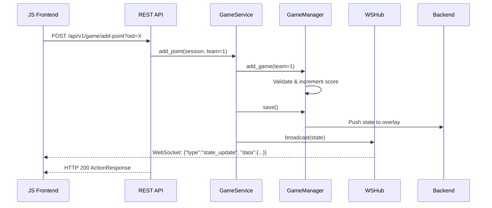

# Developer Guide — Volley Overlay Control

> A comprehensive reference for developers contributing to or extending the Volley Overlay Control codebase. For user-facing setup and configuration, see [README.md](README.md). For building a custom overlay engine, see [CUSTOM_OVERLAY.md](CUSTOM_OVERLAY.md).

---

## 1. Project Overview

Volley Overlay Control is a self-contained application that bundles a React frontend, a Python/FastAPI backend, and an overlay serving engine into a single deployable service. It manages game logic (score, sets, serving, timeouts), handles user authentication, serves the touch-friendly control UI, renders overlay templates for OBS browser sources, and synchronizes state with overlay backends (the overlays.uno cloud service or in-process custom overlays with optional external overlay server support).

The React frontend lives in the `frontend/` directory and is built with Vite. In production, FastAPI serves the built SPA as static files. During development, Vite's dev server provides hot-reload and proxies API calls to the backend.

### Tech Stack

| Layer | Technology |
| :--- | :--- |
| **Frontend** | React 19, Vite, PWA (vite-plugin-pwa) |
| **REST API** | FastAPI router at `/api/v1/` with WebSocket real-time updates |
| **HTTP Server** | Uvicorn (ASGI) — serves both the API and the frontend SPA |
| **Backend Logic** | Python 3.x |
| **State Management** | In-memory Python objects + JSON file persistence for overlay state |
| **Overlay Templates** | Jinja2 HTML templates for OBS browser sources (16 styles) |
| **Containerization** | Docker (multi-stage: Node.js + Python) |
| **CI/CD** | GitHub Actions pipelines (`.github/workflows/`) for automated testing and linting |

### Key Dependencies

**Backend (Python):**

| Package | Purpose |
| :--- | :--- |
| `fastapi` | REST API framework + static file serving |
| `uvicorn` | ASGI server |
| `requests` | HTTP communication with overlay APIs |
| `jinja2` | Overlay HTML template rendering for OBS browser sources |
| `websocket-client` | Persistent WebSocket connection to external overlay servers (optional) |
| `python-dotenv` | `.env` file loading |
| `pytest` / `pytest-asyncio` | Test suite |

**Frontend (Node.js):**

| Package | Purpose |
| :--- | :--- |
| `react` / `react-dom` | UI framework |
| `react-colorful` | Color picker component |
| `vite` | Build tool and dev server |
| `vite-plugin-pwa` | PWA support (service worker, manifest) |
| `vitest` / `@testing-library/react` | Test suite |

---

## 2. Directory Structure & Key Files

```
├── main.py                  # Entry point. Creates FastAPI app, mounts routes + SPA, starts uvicorn.
├── Dockerfile               # Multi-stage build (Node.js + Python).
├── docker-compose.yml       # Docker Compose configuration.
├── frontend/                # React control UI (built with Vite).
│   ├── package.json         # Frontend dependencies and scripts.
│   ├── vite.config.js       # Vite config (PWA, dev proxy, test setup).
│   ├── index.html           # SPA entry point.
│   ├── src/                 # React source code.
│   │   ├── App.jsx          # Main application component.
│   │   ├── api/client.js    # REST API client (relative paths: /api/v1/).
│   │   ├── api/websocket.js # WebSocket client (relative URLs).
│   │   ├── components/      # UI components (TeamPanel, ConfigPanel, etc.).
│   │   ├── hooks/           # React hooks (useGameState, useSettings, etc.).
│   │   ├── i18n.jsx         # Internationalization.
│   │   ├── theme.js         # Theme constants.
│   │   └── test/            # Vitest test suite.
│   └── public/              # Static assets (icons, fonts).
├── app/
│   ├── backend.py           # Coordinator — delegates to overlay backend strategies.
│   ├── overlay_backends.py  # Strategy pattern: UnoOverlayBackend, LocalOverlayBackend, CustomOverlayBackend.
│   ├── ws_client.py         # Persistent WebSocket client for external overlay servers (optional).
│   ├── game_manager.py      # Core business logic (rules, scoring, limits).
│   ├── state.py             # Data model definition. Holds the match state.
│   ├── customization.py     # Logic for handling team names, colors, logos, and layout.
│   ├── conf.py              # Configuration object mapping env vars to settings.
│   ├── constants.py         # Centralized hardcoded strings, URLs, and favicon.
│   ├── messages.py          # Internationalization (i18n) string definitions.
│   ├── authentication.py    # PasswordAuthenticator and AuthMiddleware.
│   ├── app_storage.py       # In-memory key-value storage.
│   ├── oid_utils.py         # OID parsing utilities (extract_oid, compose_output).
│   ├── api/                 # REST API + WebSocket layer for frontends.
│   │   ├── __init__.py      # Exports api_router.
│   │   ├── routes.py        # FastAPI endpoints under /api/v1/.
│   │   ├── schemas.py       # Pydantic request/response models.
│   │   ├── game_service.py  # Service layer — single entry point for all game actions.
│   │   ├── session_manager.py # Thread-safe game session management by OID.
│   │   ├── ws_hub.py        # WebSocket notification hub for real-time state push.
│   │   └── dependencies.py  # Auth + session FastAPI dependencies.
│   ├── overlay/             # In-process overlay serving (absorbed from volleyball-scoreboard-overlay).
│   │   ├── __init__.py      # Package init — creates singleton OverlayStateStore & ObsBroadcastHub.
│   │   ├── state_store.py   # Overlay state management — in-memory + JSON file persistence.
│   │   ├── broadcast.py     # OBS WebSocket broadcast hub — debounced 50ms pushes.
│   │   └── routes.py        # HTTP/WS routes: /overlay/, /ws/, /api/config/, CRUD, themes.
│   ├── admin/               # Overlay management page + CRUD API (password-protected).
│   │   ├── __init__.py      # Exports admin_router, admin_page_router, managed_overlays_store.
│   │   ├── routes.py        # /manage HTML page + /api/v1/admin/overlays CRUD endpoints.
│   │   ├── store.py         # OverlaysStore — thread-safe JSON persistence at data/managed_overlays.json.
│   │   └── static/overlays.html # Standalone management page (vanilla JS, no React).
│   ├── env_vars_manager.py  # Dynamic environment variable management.
│   ├── logging_config.py    # Logging level configuration.
│   ├── config_validator.py  # Startup configuration validation (env var checks).
│   └── pwa/                 # Legacy PWA assets (icons).
├── overlay_templates/       # Jinja2 HTML templates for overlay styles (16 templates).
├── overlay_static/          # Static assets for overlays (JS, CSS, images).
├── data/                    # Persisted overlay state files (overlay_state_{id}.json) and managed overlay catalogue (managed_overlays.json).
├── font/                    # Custom font files for the overlay.
└── tests/                   # Pytest suite.
    ├── conftest.py          # Test fixtures and configuration.
    ├── test_api.py          # API layer tests (SessionManager, GameService, auth).
    ├── test_backend.py      # Backend API communication tests.
    ├── test_customization.py # Customization logic tests.
    ├── test_env_vars_manager.py # Environment variable manager tests.
    ├── test_game_manager.py     # Game rules and scoring tests.
    ├── test_state.py            # State model tests.
    ├── test_config_validator.py # Startup configuration validation tests.
    ├── test_ws_client.py        # WebSocket client and Backend WS integration tests.
    ├── test_admin.py            # Overlay manager page + CRUD + auth tests.
    └── test_coverage_proposals.py # Additional WSControlClient coverage tests.
```

---

## 3. Core Architecture & Data Flow

The application follows a service-oriented architecture:

| Role | Component | Description |
| :--- | :--- | :--- |
| **Model** | `State` | Snapshot of the game (scores, timeouts, serve status) |
| **Controller** | `GameManager` | Manipulates the Model based on volleyball rules |
| **Service** | `GameService` | Single entry point for all game actions |
| **API** | `api/routes.py` | REST + WebSocket endpoints for frontends |
| **Sync** | `Backend` | Pushes Model changes to overlay backends (in-process or cloud) |
| **Overlay** | `OverlayStateStore` | In-memory + JSON persistence for custom overlay state |
| **Overlay** | `ObsBroadcastHub` | Debounced WebSocket broadcasts to OBS browser sources |

### Data Flow (e.g., Adding a Point from a JS Frontend)



See [FRONTEND_DEVELOPMENT.md](FRONTEND_DEVELOPMENT.md) for the complete API reference.

---

## 4. Class & Method Reference

### A. Core Logic

#### `app/state.py` — class `State`

Represents the data structure of the match.

- **Responsibility**: Holds the "Single Source of Truth" dictionary (`current_model`) that maps keys (e.g., `'Team 1 Sets'`) to values.
- **Key Methods**:
  - `get_game(team, set)` / `set_game(...)` — Get/Set points for a specific set.
  - `get_sets(team)` / `set_sets(...)` — Get/Set sets won.
  - `simplify_model(simplified)` — Prepares the state for "simple mode" (reduced data payload).

#### `app/game_manager.py` — class `GameManager`

The "Brain" of the application. Enforces volleyball rules.

- **Responsibility**: Manipulate `State` safely.
- **Key Methods**:
  - `add_game(team, ...)` — Increments score. Handles "Winning by 2", point limits, and match completion.
  - `add_set(team)` — Increments set count. Resets timeouts and serve for the next set.
  - `change_serve(team)` — Updates the serving indicator.
  - `match_finished()` — Returns `True` if a team has reached the set limit.
  - `save(simple, current_set)` — Persists state via `Backend`.

#### `app/backend.py` — class `Backend`

The "Bridge" to overlay systems.

- **Responsibility**: Coordinates overlay communication using the strategy pattern. Delegates to `LocalOverlayBackend` (in-process, default for custom overlays), `CustomOverlayBackend` (external server, when `APP_CUSTOM_OVERLAY_URL` is set), or `UnoOverlayBackend` (cloud).
- **Key Internals**:
  - Uses a shared `requests.Session` for all HTTP calls to enable TCP connection reuse.
  - A `ThreadPoolExecutor` (5 workers) handles overlay updates asynchronously when `ENABLE_MULTITHREAD=true`.
  - `_customization_cache` — In-memory cache for the last fetched customization state.
  - `_build_overlay_payload()` — Constructs the standardized overlay state JSON from game model + customization.
- **Key Methods**:
  - `get_current_model()` — Fetches the last known state from the overlay backend.
  - `get_current_customization()` — Fetches team/color/layout settings.
  - `save_model(current_model, simple)` — Pushes local state changes to the overlay.
  - `change_overlay_visibility(show)` — Toggles overlay show/hide.

#### `app/overlay_backends.py` — Overlay Backend Strategies

Three overlay backend implementations share the `OverlayBackend` abstract interface:

- **`LocalOverlayBackend`** — Default for custom overlays (`C-` prefix). Manages state in-process via `OverlayStateStore`, broadcasts to OBS via `ObsBroadcastHub`. No external server needed.
- **`CustomOverlayBackend`** — Optional external server mode (activated when `APP_CUSTOM_OVERLAY_URL` is set). Communicates via WebSocket + HTTP fallback.
- **`UnoOverlayBackend`** — Cloud overlays. Communicates with the overlays.uno REST API.

#### `app/overlay/state_store.py` — class `OverlayStateStore`

In-memory + JSON file persistence for overlay state.

- **Responsibility**: Manages overlay state with lazy-loading from disk, deep merge, normalization, CRUD, raw config pass-through, output key generation, and style enumeration.
- **Key Methods**: `get_state()`, `update_state()`, `set_raw_config()`, `get_raw_config()`, `create_overlay()`, `ensure_overlay()`, `get_available_styles_list()`.

#### `app/overlay/broadcast.py` — class `ObsBroadcastHub`

Debounced WebSocket broadcasts to OBS browser sources.

- **Responsibility**: Tracks OBS browser source WebSocket connections per overlay and broadcasts state updates with 50ms debouncing.
- **Key Methods**: `add_client()`, `remove_client()`, `schedule_broadcast()`, `get_client_count()`.

#### `app/ws_client.py` — class `WSControlClient`

Persistent WebSocket connection to an external custom overlay server's `/ws/control/{overlay_id}` endpoint. Only used when `APP_CUSTOM_OVERLAY_URL` is set.

- **Responsibility**: Maintains a background daemon thread with auto-reconnect and heartbeat.
- **Key Methods**: `connect()`, `disconnect()`, `send_state()`, `send_visibility()`, `send_raw_config()`.

### B. API Layer

#### `app/api/game_service.py` — class `GameService`

Stateless service that operates on `GameSession` instances.

- **Key Methods**: `add_point()`, `add_set()`, `add_timeout()`, `change_serve()`, `set_score()`, `reset()`, `set_visibility()`, `set_simple_mode()`, `update_customization()`.

#### `app/api/session_manager.py` — class `SessionManager`

Thread-safe singleton managing `GameSession` instances by OID.

- **Key Methods**: `get_or_create()`, `get()`, `remove()`, `clear()`, `cleanup_expired()`.

#### `app/api/ws_hub.py` — class `WSHub`

WebSocket notification hub for broadcasting state updates to connected frontend clients.

#### `app/admin/` — overlay management

Standalone surface for managing predefined overlays at runtime, independent of
the React scoreboard UI.

- **`app/admin/store.py`** — `OverlaysStore`: thread-safe CRUD on
  `data/managed_overlays.json`. `create()`, `update()` (with optional
  `new_name=` for renames), `delete()`, `list()`, `as_dict()`. The
  module-level singleton `managed_overlays_store` is reused by
  `GET /api/v1/overlays` to merge managed overlays into the list.
- **`app/admin/routes.py`** — Two FastAPI routers:
  - `admin_page_router` → `GET /manage` serves the standalone HTML page.
  - `admin_router` → `GET|POST|PUT|DELETE /api/v1/admin/overlays[/{name}]`,
    `POST /api/v1/admin/login`, `GET /api/v1/admin/status`. All endpoints
    (except `/status`) require `Authorization: Bearer $OVERLAY_MANAGER_PASSWORD`.
- **`app/admin/static/overlays.html`** — Self-contained page (no React,
  just vanilla JS + `fetch`). Stores the password in `sessionStorage` under
  `overlay_manager_password`.

The routers are registered in `main.py` **before** the SPA mount so that
`/manage` is served by FastAPI rather than falling through to `index.html`.

### C. Configuration & Extras

#### `app/customization.py`

- **Responsibility**: Manages cosmetic data (Team Names, Logos, Colors, Overlay geometry).

#### `app/app_storage.py` — class `AppStorage`

- **Responsibility**: In-memory key-value storage for session state.

#### `app/conf.py`

- **Responsibility**: Loads environment variables into a structured `Conf` object.

#### `app/oid_utils.py`

- **Responsibility**: Overlay ID parsing utilities — `extract_oid()` extracts OIDs from full overlays.uno URLs, `compose_output()` ensures output URLs are fully qualified.

#### `app/messages.py`

- **Responsibility**: Internationalization (i18n). Currently supports **English** (default) and **Spanish**.

#### `app/config_validator.py`

- **Responsibility**: Validates environment variables at startup. Logs warnings for misconfigurations.

---

## 5. Testing

### Running Tests Locally

```bash
# Backend tests
pip install -r requirements.txt
pip install -r requirements-dev.txt
pytest tests/

# Frontend tests
cd frontend && npm ci && npm test
```

### Backend Test Organization

| File | Coverage Area |
| :--- | :--- |
| `test_state.py` | `State` model operations |
| `test_game_manager.py` | Scoring rules, set logic, undo functionality |
| `test_backend.py` | API communication, custom overlay integration |
| `test_api.py` | SessionManager, GameService, API key auth |
| `test_customization.py` | Team/color customization logic |
| `test_env_vars_manager.py` | Environment variable loading |
| `test_config_validator.py` | Startup environment variable validation |
| `test_ws_client.py` | WebSocket client unit tests and Backend WS integration |
| `test_coverage_proposals.py` | Additional WSControlClient message format tests |

### Frontend Tests

Frontend tests use Vitest + React Testing Library and live in `frontend/src/test/`. They cover API client, WebSocket client, all UI components, hooks, i18n, and theming.

### CI Pipeline

The GitHub Actions CI pipeline (`.github/workflows/ci.yml`) runs on `push` / `pull_request` to `main` and `dev` branches:

1. **Lint** — `flake8` for syntax errors and style warnings.
2. **Test** — Full `pytest tests/` suite.

---

## 6. Important Logic Flows for Developers

### State Synchronization

The app assumes it is the **primary controller**. However, `GameManager.reset()` reloads data from `Backend` to ensure it syncs with any external resets.

### Custom Overlay State Flow

By default, custom overlays (`C-` prefix) are managed **in-process** by `LocalOverlayBackend`. State flows directly from `GameManager` → `LocalOverlayBackend` → `OverlayStateStore` → `ObsBroadcastHub` → OBS browser sources — no inter-process communication needed.

If `APP_CUSTOM_OVERLAY_URL` is set, the system falls back to `CustomOverlayBackend` which communicates with an external overlay server. See [CUSTOM_OVERLAY.md](CUSTOM_OVERLAY.md) for the external server API contract and [ARCHITECTURE.md](../ARCHITECTURE.md) for the full data flow diagrams.

---

## 7. Common Modification Scenarios

### Adding a new Rule (e.g., Golden Set)

1. Modify `app/game_manager.py` -> `add_game` to check for the new condition.
2. Update `app/state.py` if new counters are needed.

### Adding a new API Endpoint

1. Add the route in `app/api/routes.py`.
2. Add request/response schemas in `app/api/schemas.py`.
3. Add the business logic in `app/api/game_service.py`.

### Extending the overlay manager page

1. Extend the storage layer in `app/admin/store.py` (remember that all
   mutations must call `_write_to_disk()` under `self._lock`).
2. Add or update the matching FastAPI route in `app/admin/routes.py` and
   keep it behind `Depends(require_admin)`.
3. Update the UI in `app/admin/static/overlays.html` — it is a single
   self-contained file with vanilla JS, so no bundler step is needed.

### Adding a new Setting

1. Add field to `app/conf.py`.
2. Add the env var to `docker-compose.yml` and `README.md`.

### Adding a new Language

1. Add a new key to the `messages` dictionary in `app/messages.py`.
2. Set `SCOREBOARD_LANGUAGE` environment variable to the new language code.

---

## 8. Environment Setup (Quick Start)

```bash
# 1. Clone the repository
git clone <repo-url>
cd volley-overlay-control

# 2. Create a virtual environment (recommended)
python -m venv .venv
source .venv/bin/activate  # Windows: .venv\Scripts\activate

# 3. Install backend dependencies
pip install -r requirements.txt

# 4. Build the frontend
cd frontend && npm ci && npm run build && cd ..

# 5. Configure environment
# Create a .env file with your settings, for example:
# UNO_OVERLAY_OID=your_token_here
# SCOREBOARD_USERS={"admin": {"password": "secret"}}

# 6. Run the application (serves both API and UI on port 8080)
python main.py

# 7. Run the test suites
pytest tests/ -v           # Backend tests
cd frontend && npm test    # Frontend tests
```

### Frontend Development with Hot-Reload

For active frontend work, use Vite's dev server instead of the built static files:

```bash
# Terminal 1: Start the backend
python main.py

# Terminal 2: Start the Vite dev server (hot-reload on port 3000)
cd frontend && npm run dev
```

Vite proxies all `/api` requests to `http://localhost:8080`. Open `http://localhost:3000` for development.
