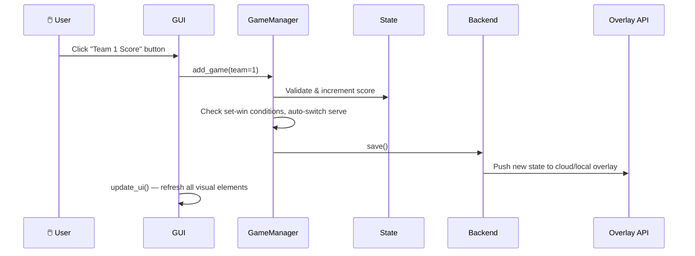

# Developer Guide — Volley Overlay Control

> A comprehensive reference for developers contributing to or extending the Volley Overlay Control codebase. For user-facing setup and configuration, see [README.md](README.md). For building a custom overlay engine, see [CUSTOM_OVERLAY.md](CUSTOM_OVERLAY.md).

---

## 1. Project Overview

Volley Overlay Control is a web-based application built with Python and NiceGUI. It serves as a remote control for updating volleyball scoreboards (overlays) in real-time. The application manages game logic (score, sets, serving, timeouts), handles user authentication, and synchronizes state with an external backend (the overlays.uno system or a custom overlay server).

### Tech Stack

| Layer | Technology |
| :--- | :--- |
| **Frontend/UI** | [NiceGUI](https://nicegui.io) (Vue/Quasar rendered via Python) — or any JS framework via REST API |
| **REST API** | FastAPI router at `/api/v1/` with WebSocket real-time updates |
| **Backend Logic** | Python 3.x |
| **Styling** | Tailwind CSS (via NiceGUI utility classes) and `app/theme.py` |
| **State Management** | In-memory Python objects synchronized with an external API |
| **Containerization** | Docker (using `uv` for package management) |
| **CI/CD** | GitHub Actions pipelines (`.github/workflows/`) for automated testing and linting |

### Key Dependencies

| Package | Purpose |
| :--- | :--- |
| `nicegui` | Full-stack web UI framework |
| `requests` | HTTP communication with overlay APIs |
| `websocket-client` | Persistent WebSocket connection to custom overlay servers |
| `python-dotenv` | `.env` file loading |
| `pytest` / `pytest-asyncio` | Test suite |
| `playwright` | Browser-based UI tests (CI only) |

---

## 2. Directory Structure & Key Files

```
├── main.py                  # Entry point. Sets up the NiceGUI app, middleware, and env vars.
├── .github/                 # GitHub specific files.
│   └── workflows/           # CI/CD pipelines (ci.yml, docker-publish.yml, docker-publish-dev.yml).
├── app/
│   ├── backend.py           # Handles communication with the external Overlay API & local overlay.
│   ├── ws_client.py         # Persistent WebSocket client for custom overlay control channel.
│   ├── game_manager.py      # Core business logic (rules, scoring, limits).
│   ├── state.py             # Data model definition. Holds the raw state dictionary.
│   ├── gui.py               # Main UI logic orchestrator.
│   ├── components/          # Reusable NiceGUI UI components (ScoreButton, TeamPanel, etc.).
│   ├── startup.py           # Route definitions, page loading logic, and lifecycle hooks.
│   ├── customization.py     # Logic for handling team names, colors, logos, and layout.
│   ├── customization_page.py # UI page for customization options.
│   ├── theme.py             # UI constants (colors, CSS classes, font scales).
│   ├── conf.py              # Configuration object mapping env vars to settings.
│   ├── constants.py         # Centralized hardcoded strings, URLs, and favicon.
│   ├── messages.py          # Internationalization (i18n) string definitions.
│   ├── authentication.py    # User login/logout logic and AuthMiddleware.
│   ├── app_storage.py       # Wrapper for NiceGUI's browser-local storage.
│   ├── api/                 # REST API + WebSocket layer for external frontends.
│   │   ├── __init__.py      # Exports api_router.
│   │   ├── routes.py        # FastAPI endpoints under /api/v1/.
│   │   ├── schemas.py       # Pydantic request/response models.
│   │   ├── game_service.py  # Service layer — single entry point for all game actions.
│   │   ├── session_manager.py # Thread-safe game session management by OID.
│   │   ├── ws_hub.py        # WebSocket notification hub for real-time state push.
│   │   └── dependencies.py  # Auth + session FastAPI dependencies.
│   ├── env_vars_manager.py  # Dynamic environment variable management.
│   ├── logging_config.py    # Logging level configuration.
│   ├── options_dialog.py    # Settings/configuration dialog UI.
│   ├── oid_dialog.py        # Overlay ID entry dialog UI.
│   ├── preview.py           # Preview logic.
│   ├── preview_page.py      # Preview page UI.
│   ├── gui_update_mixin.py  # Mixin with UI refresh helper methods for GUI.
│   ├── config_validator.py  # Startup configuration validation (env var checks).
│   └── pwa/                 # Progressive Web App assets (Service Worker, Manifest, Icons).
├── .web/                    # Optional local overlay frontend (React-Router based).
├── font/                    # Custom font files for the UI/Overlay (10 fonts).
├── storage/                 # Local data and temp storage directories.
├── tests/                   # Pytest suite.
│   ├── conftest.py          # Test fixtures and configuration.
│   ├── test_backend.py      # Backend API communication tests.
│   ├── test_customization.py # Customization logic tests.
│   ├── test_env_vars_manager.py # Environment variable manager tests.
│   ├── test_game_manager.py     # Game rules and scoring tests.
│   ├── test_state.py            # State model tests.
│   ├── test_config_validator.py # Startup configuration validation tests.
│   ├── test_ws_client.py        # WebSocket client and Backend WS integration tests.
│   ├── test_mobile_viewport.py  # Mobile viewport/PWA browser tests (Playwright).
│   └── test_ui.py               # Full UI interaction tests (Playwright/NiceGUI).
└── docker-compose.yml           # Docker Compose configuration.
```

---

## 3. Core Architecture & Data Flow

The application follows a **Model-View-Controller (MVC)** hybrid pattern:

| Role | Component | Description |
| :--- | :--- | :--- |
| **Model** | `State` | Snapshot of the game (scores, timeouts, serve status) |
| **Controller** | `GameManager` | Manipulates the Model based on volleyball rules |
| **Service** | `GameService` | Single entry point for all game actions (used by GUI and REST API) |
| **View** | `GUI` | NiceGUI display — captures user input |
| **API** | `api/routes.py` | REST + WebSocket endpoints for external frontends |
| **Sync** | `Backend` | Pushes Model changes to the external overlay server |

### Typical Data Flow (e.g., Adding a Point)



### REST API Flow (e.g., Adding a Point from a JS Frontend)


> **Note:** Both the NiceGUI frontend and external JS frontends use the same `GameService` layer, ensuring identical business logic and state management. See [FRONTEND_DEVELOPMENT.md](FRONTEND_DEVELOPMENT.md) for the complete API reference.

---

## 4. Class & Method Reference

### A. Core Logic

#### `app/state.py` — class `State`

Represents the data structure of the match.

- **Responsibility**: Holds the "Single Source of Truth" dictionary (`current_model`) that maps keys (e.g., `'Team 1 Sets'`) to values.
- **Key Attributes**:
  - `reset_model` — Default/zero state dictionary.
  - `current_model` — Active state dictionary.
- **Key Methods**:
  - `get_game(team, set)` / `set_game(...)` — Get/Set points for a specific set.
  - `get_sets(team)` / `set_sets(...)` — Get/Set sets won.
  - `simplify_model(simplified)` — Prepares the state for "simple mode" (reduced data payload).

#### `app/game_manager.py` — class `GameManager`

The "Brain" of the application. Enforces volleyball rules.

- **Responsibility**: Manipulate `State` safely.
- **Key Methods**:
  - `add_game(team, ...)` — Increments score. Handles "Winning by 2", point limits, and match completion.
  - `add_set(team)` — Increments set count. Resets timeouts and serve for the next set.
  - `change_serve(team)` — Updates the serving indicator.
  - `undo` — (Boolean flag passed to methods) Reverses the last action.
  - `match_finished()` — Returns `True` if a team has reached the set limit.
  - `save(simple, current_set)` — Persists state via `Backend`.

#### `app/backend.py` — class `Backend`

The "Bridge" to the outside world.

- **Responsibility**: Communication with the Overlay API — WebSocket-first for custom overlays, HTTP fallback, HTTP-only for cloud overlays.
- **Key Internals**:
  - Uses a shared `requests.Session` for all HTTP calls to enable TCP connection reuse (lower latency on repeated posts).
  - `_ws_client` — `WSControlClient` instance for the active custom overlay WebSocket connection (or `None`).
  - `_customization_cache` — In-memory cache for the last fetched customization state, preventing redundant GET requests on every score update.
  - A `ThreadPoolExecutor` (5 workers) handles overlay updates asynchronously when `ENABLE_MULTITHREAD=true`.
- **Key Methods**:
  - `init_ws_client()` — Discovers `controlWebSocketUrl` from `/api/config/{id}` and creates a `WSControlClient` with auto-connect. Called once during startup for custom overlays.
  - `close_ws_client()` — Disconnects the WebSocket client and clears the reference.
  - `get_current_model()` — Fetches the last known state from the remote API. For Custom Overlays, hits `/api/raw_config/{id}` to bypass local caching.
  - `get_current_customization()` — Fetches team/color/layout settings. Result is cached in `_customization_cache`.
  - `save(state, simple)` — Pushes local state changes to the cloud and proxies to the local overlay engine via `update_local_overlay()`. For custom overlays, also syncs raw state JSON via WebSocket `raw_config` or `POST /api/raw_config/{id}`.
  - `update_local_overlay(current_model, force_visibility, customization_state)` — Builds a standardized JSON payload (`match_info`, `team_home`/`team_away`, `overlay_control`) via `_build_overlay_payload()`. Sends via `WSControlClient.send_state()` if connected, otherwise falls back to HTTP `POST /api/state/{custom_id}`.
  - `change_overlay_visibility(show)` — Sends visibility toggle via WebSocket `send_visibility()` for custom overlays when connected, otherwise uses the HTTP path.
  - `fetch_and_update_overlay_id(oid)` — Translates a user's Control Token (OID) into the specific backend layout ID via `GetOverlays`.
  - `fetch_output_token(oid)` — Retrieves the URL/Token required to display the overlay iframe. Called automatically during `POST /api/v1/session/init` when no explicit `output_url` is provided, so the session's `conf.output` is always populated.
- **Properties**: `ws_connected` (bool), `obs_client_count` (int from WS handshake/ack messages).

#### `app/ws_client.py` — class `WSControlClient`

Persistent WebSocket connection to a custom overlay server's `/ws/control/{overlay_id}` endpoint.

- **Responsibility**: Maintains a background daemon thread with auto-reconnect and heartbeat for low-latency state pushes.
- **Key Internals**:
  - Background thread runs `_run_loop()` → `_listen()` with exponential backoff reconnect (1s → 30s max).
  - Thread-safe sends via `threading.Lock`.
  - Heartbeat pings every 25 seconds (inside the server's 30s timeout).
  - Lazy imports `websocket-client` to avoid import errors when the package isn't installed.
- **Key Methods**:
  - `connect()` / `disconnect()` — Start/stop the background thread.
  - `send_state(payload)` — Send a `state_update` message.
  - `send_visibility(show)` — Send a `visibility` toggle.
  - `send_raw_config(payload)` — Send a `raw_config` message (model and/or customization).
  - `send_get_state()` — Request current state from the server.
- **Properties**: `is_connected` (bool), `obs_client_count` (int — updated from server messages).

### B. User Interface

#### `app/components/`

Modular UI components to prevent `gui.py` from becoming a monolith:

| File | Purpose |
| :--- | :--- |
| `score_button.py` | Wraps `ui.button` with long-press and tap detection logic |
| `team_panel.py` | Renders a team column (Scores, Timeouts, Serve Indicator) |
| `center_panel.py` | Manages the middle column (Score table, set pagination, Preview iframe) |
| `control_buttons.py` | Manages action bars (Visibility toggle, Simple Mode, Undo, Config) |
| `button_interaction.py` | Long-press (1s) vs tap (0.4s) vs double-tap detection logic |
| `button_style.py` | Button appearance utilities (colors, fonts, opacity) |

#### `app/gui.py` — class `GUI`

The NiceGUI presentation layer orchestrator.

- **Responsibility**: Instantiate modular components, listen for state changes from `GameManager`, and trigger updates.
- **Key Internals**:
  - `_instances` — Class-level `weakref.WeakSet` of all active `GUI` instances across connected browser tabs.
  - `_client` — Reference to the NiceGUI `Client` for this instance, used by `_broadcast_to_others` to skip stale/deleted clients.
- **Key Methods**:
  - `init(...)` — Builds the initial layout by instantiating `TeamPanel`, `CenterPanel`, and `ControlButtons`.
  - `update_ui(load_from_backend)` — Refreshes all visual elements (scores, colors, logos).
  - `handle_button_press/release` — Processes "Long Press", "Tap", and "Double Tap" (undo) logic.
  - `switch_simple_mode()` — Toggles between full detail and simplified view.
  - `_broadcast_to_others()` — Notifies all other connected GUI instances to refresh after a state change. Checks `Client.instances` before syncing state. To avoid performance bottlenecks, state is deep-copied directly between instances instead of requesting a full backend reload for every client.

#### `app/gui_update_mixin.py` — `GUIUpdateMixin`

Mixin class providing UI refresh helper methods used by `GUI`.

- **Responsibility**: Extracts common UI update patterns out of the main `GUI` class to reduce its size.
- **Usage**: `GUI` inherits from this mixin. Do not instantiate it directly.

#### `app/startup.py` — `startup()`

- **Responsibility**: Defines application routing (`/`, `/indoor`, `/beach`, `/login`, `/preview`, `/health`) and startup sequence.
- **Logic**:
  - Checks for `oid` (Overlay ID) in URL → Storage → Environment.
  - If missing, launches `OidDialog`.
  - Initializes `GUI` and `Backend`.
  - Serves PWA assets (`/sw.js`, `/manifest.json`, `/pwa/*`), registers the Service Worker, and implements Screen Wake Lock API logic.

#### `app/theme.py`

- **Responsibility**: Centralized configuration for UI colors (Tailwind classes) and button styles.
- **Key Constants**:
  - `GAME_BUTTON_CLASSES` — Shape, shadow, and text alignment for score buttons.
  - `TACOLOR` / `TBCOLOR` — Team colors.
  - `FONT_SCALES` — Per-font `scale` multiplier and vertical `offset_y` for consistent rendering.

### C. Configuration & Extras

#### `app/customization.py` & `app/customization_page.py`

- **Responsibility**: Manages cosmetic data (Team Names, Logos, Colors, Overlay geometry).
- **Logic**: Abstracts payload keys to support multiple layout templates. Falls back from `Team 1 Text Name` to `Team 1 Name` if needed. `customization_page.py` hides components unsupported by the active layout.

#### `app/app_storage.py` — class `AppStorage`

- **Responsibility**: Unified wrapper around NiceGUI's browser-local user storage (`app.storage.user`) with an in-memory fallback for test environments.
- **Key Methods**:
  - `save(tag, value, oid=None)` — Persists a value under a `Category` enum key, optionally scoped to an OID.
  - `load(tag, default, oid=None)` — Loads a persisted value, returning `default` if not found.
  - `refresh_state(oid, preserve_keys)` — Clears or partially resets the OID-scoped storage bucket.
- **Notes**: Catches both `RuntimeError` and `AssertionError` when accessing `app.storage.user` so early startup calls (before the NiceGUI session is fully initialized) fall back to in-memory storage gracefully.

#### `app/conf.py`

- **Responsibility**: Loads environment variables (e.g., `APP_PORT`, `UNO_OVERLAY_URL`) into a structured `Conf` object. Some values (e.g., `lock_teamA_icons`, `auto_hide`) are `@property` accessors that read from `AppStorage` first, falling back to the env var default.

#### `app/messages.py`

- **Responsibility**: Internationalization (i18n). Defines all user-facing strings with translations. Currently supports **English** (default) and **Spanish**.

#### `app/constants.py`

- **Responsibility**: Centralized hardcoded strings, the SVG favicon, and the `API_BASE_URL` for overlays.uno.

#### `app/config_validator.py`

- **Responsibility**: Validates environment variables and configuration at startup. Checks for required values, valid JSON formatting, and compatible option combinations. Logs warnings or raises errors for misconfigurations before the app fully initializes.

---

## 5. Testing

### Running Tests Locally

```bash
# Install runtime and dev/test dependencies
pip install -r requirements.txt
pip install -r requirements-dev.txt

# For browser-based tests (optional)
pip install playwright pytest-playwright
playwright install chromium

# Run the full test suite
pytest tests/

# Run a specific test file
pytest tests/test_game_manager.py -v

# Run with log output
pytest tests/ --log-cli-level=debug
```

### Test Organization

| File | Coverage Area |
| :--- | :--- |
| `test_state.py` | `State` model operations |
| `test_game_manager.py` | Scoring rules, set logic, undo functionality |
| `test_backend.py` | API communication, custom overlay integration |
| `test_customization.py` | Team/color customization logic |
| `test_env_vars_manager.py` | Environment variable loading |
| `test_config_validator.py` | Startup environment variable validation |
| `test_ws_client.py` | WebSocket client unit tests and Backend WS integration tests |
| `test_mobile_viewport.py` | Mobile viewport/PWA rendering (Playwright + Chromium, marked `mobile_browser`) |
| `test_ui.py` | Full end-to-end UI tests via NiceGUI's test client |

### CI Pipeline

The GitHub Actions CI pipeline (`.github/workflows/ci.yml`) runs on `push` / `pull_request` to `main` and `dev` branches:

1. **Lint** — `flake8` for syntax errors and style warnings.
2. **Test** — Full `pytest tests/` suite with Playwright (Chromium).

---

## 6. Important Logic Flows for Developers

When modifying the code, keep these dependencies in mind:

### UI Updates

NiceGUI is reactive but often requires manual calls to `element.update()` or `set_text()`.

> [!IMPORTANT]
> If you modify `State` in `GameManager`, you **must** ensure `GUI.update_ui()` is triggered so the user sees the change.

### Long Press Logic

The buttons in `GUI` use a timer-based system to distinguish between a **tap** (Add Point) and a **hold** (Open Edit Dialog). Do not remove the `touchstart`/`mousedown` event listeners without preserving this logic.

### Multi-User Broadcast

When multiple browser tabs are open, `GUI._broadcast_to_others()` notifies all other registered instances after a state change. Before pushing state to a foreign instance it checks `client.id in Client.instances` — if the tab was closed and NiceGUI deleted its client, the broadcast skips that instance silently. Any new `GUI` instance stores `self._client = ui.context.client` during `__init__` for this check. To ensure fast synchronization without hammering the overlay backend with HTTP requests, the originating instance deep-copies its current `GameManager` and `Customization` state to the targeted instances directly in-memory before triggering their UI updates.

### State Synchronization

The app assumes it is the **primary controller**. However, `GameManager.reset()` reloads data from `Backend` to ensure it syncs with any external resets.

### Responsive Design

`GUI` detects orientation (`is_portrait`). Layouts switch between `ui.row()` (Landscape) and `ui.column()` (Portrait). Any new UI elements must handle both contexts.

### Custom Fonts

The app loads custom fonts from the `font/` directory. These are applied via CSS injection in `startup.py` and used in `theme.py` / `gui.py`.

> [!NOTE]
> Custom fonts are normalized via `FONT_SCALES` in `theme.py`. These values were generated by rendering each font in a flex container and mathematically measuring painted pixels. New font additions should be measured and added to `FONT_SCALES`.

---

## 7. Common Modification Scenarios

### Adding a new Rule (e.g., Golden Set)

1. Modify `app/game_manager.py` → `add_game` to check for the new condition.
2. Update `app/state.py` if new counters are needed.

### Changing Button Styles

1. Edit `app/theme.py` constants.
2. If logic-based (e.g., color changes on win), edit `app/gui.py` → `update_button_style`.

### Adding a new Setting

1. Add field to `app/conf.py` (or `app/env_vars_manager.py` for dynamic env vars).
2. Add UI control to `app/options_dialog.py`.
3. Pass the config to `GameManager` if it affects rules.

### Adding a new Language

1. Add a new key to the `messages` dictionary in `app/messages.py`.
2. Translate all existing string constants to the new language.
3. Set `SCOREBOARD_LANGUAGE` environment variable to the new language code.

---

## 8. Environment Setup (Quick Start)

```bash
# 1. Clone the repository
git clone <repo-url>
cd remote-scoreboard

# 2. Create a virtual environment (recommended)
python -m venv .venv
# Windows:
.venv\Scripts\activate
# Linux/macOS:
source .venv/bin/activate

# 3. Install dependencies
pip install -r requirements.txt

# 4. Configure environment
# Create a .env file with your settings, for example:
# UNO_OVERLAY_OID=your_token_here
# SCOREBOARD_USERS={"admin": {"password": "secret"}}

# 5. Run the application
python main.py

# 6. Run the test suite
pytest tests/ -v
```