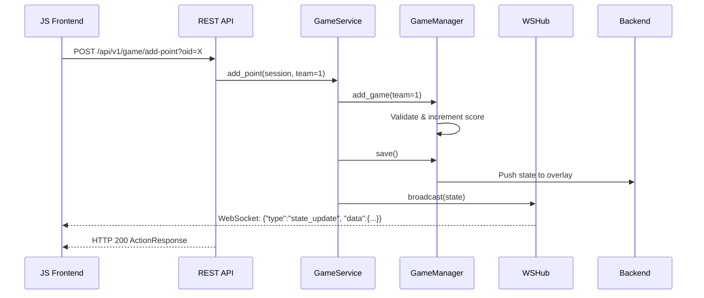

# Developer Guide — Volley Overlay Control

> A comprehensive reference for developers contributing to or extending the Volley Overlay Control codebase. For user-facing setup and configuration, see [README.md](README.md). For building a custom overlay engine, see [CUSTOM_OVERLAY.md](CUSTOM_OVERLAY.md).

---

## 1. Project Overview

Volley Overlay Control is a Python backend service built with FastAPI. It serves as a remote control for updating volleyball scoreboards (overlays) in real-time. The application manages game logic (score, sets, serving, timeouts), handles user authentication, and synchronizes state with an external overlay backend (the overlays.uno system or a custom overlay server).

The frontend is provided by a separate React application ([volley-control-ui](../volley-control-ui)) that communicates with this backend via REST API and WebSocket.

### Tech Stack

| Layer | Technology |
| :--- | :--- |
| **REST API** | FastAPI router at `/api/v1/` with WebSocket real-time updates |
| **HTTP Server** | Uvicorn (ASGI) |
| **Backend Logic** | Python 3.x |
| **State Management** | In-memory Python objects synchronized with an external API |
| **Containerization** | Docker |
| **CI/CD** | GitHub Actions pipelines (`.github/workflows/`) for automated testing and linting |

### Key Dependencies

| Package | Purpose |
| :--- | :--- |
| `fastapi` | REST API framework |
| `uvicorn` | ASGI server |
| `requests` | HTTP communication with overlay APIs |
| `websocket-client` | Persistent WebSocket connection to custom overlay servers |
| `python-dotenv` | `.env` file loading |
| `pytest` / `pytest-asyncio` | Test suite |

---

## 2. Directory Structure & Key Files

```
├── main.py                  # Entry point. Creates FastAPI app, mounts routes, starts uvicorn.
├── .github/                 # GitHub specific files.
│   └── workflows/           # CI/CD pipelines (ci.yml, docker-publish.yml, docker-publish-dev.yml).
├── app/
│   ├── backend.py           # Handles communication with the external Overlay API & local overlay.
│   ├── ws_client.py         # Persistent WebSocket client for custom overlay control channel.
│   ├── overlay_backends.py  # Strategy pattern: UnoOverlayBackend and CustomOverlayBackend.
│   ├── game_manager.py      # Core business logic (rules, scoring, limits).
│   ├── state.py             # Data model definition. Holds the match state.
│   ├── customization.py     # Logic for handling team names, colors, logos, and layout.
│   ├── conf.py              # Configuration object mapping env vars to settings.
│   ├── constants.py         # Centralized hardcoded strings, URLs, and favicon.
│   ├── messages.py          # Internationalization (i18n) string definitions.
│   ├── authentication.py    # PasswordAuthenticator and AuthMiddleware.
│   ├── app_storage.py       # In-memory key-value storage.
│   ├── oid_utils.py         # OID parsing utilities (extract_oid, compose_output).
│   ├── api/                 # REST API + WebSocket layer for frontends.
│   │   ├── __init__.py      # Exports api_router.
│   │   ├── routes.py        # FastAPI endpoints under /api/v1/.
│   │   ├── schemas.py       # Pydantic request/response models.
│   │   ├── game_service.py  # Service layer — single entry point for all game actions.
│   │   ├── session_manager.py # Thread-safe game session management by OID.
│   │   ├── ws_hub.py        # WebSocket notification hub for real-time state push.
│   │   └── dependencies.py  # Auth + session FastAPI dependencies.
│   ├── env_vars_manager.py  # Dynamic environment variable management.
│   ├── logging_config.py    # Logging level configuration.
│   ├── config_validator.py  # Startup configuration validation (env var checks).
│   └── pwa/                 # Progressive Web App assets (Service Worker, Manifest, Icons).
├── font/                    # Custom font files for the overlay.
├── tests/                   # Pytest suite.
│   ├── conftest.py          # Test fixtures and configuration.
│   ├── test_api.py          # API layer tests (SessionManager, GameService, auth).
│   ├── test_backend.py      # Backend API communication tests.
│   ├── test_customization.py # Customization logic tests.
│   ├── test_env_vars_manager.py # Environment variable manager tests.
│   ├── test_game_manager.py     # Game rules and scoring tests.
│   ├── test_state.py            # State model tests.
│   ├── test_config_validator.py # Startup configuration validation tests.
│   ├── test_ws_client.py        # WebSocket client and Backend WS integration tests.
│   └── test_coverage_proposals.py # Additional WSControlClient coverage tests.
└── docker-compose.yml           # Docker Compose configuration.
```

---

## 3. Core Architecture & Data Flow

The application follows a service-oriented architecture:

| Role | Component | Description |
| :--- | :--- | :--- |
| **Model** | `State` | Snapshot of the game (scores, timeouts, serve status) |
| **Controller** | `GameManager` | Manipulates the Model based on volleyball rules |
| **Service** | `GameService` | Single entry point for all game actions |
| **API** | `api/routes.py` | REST + WebSocket endpoints for frontends |
| **Sync** | `Backend` | Pushes Model changes to the external overlay server |

### Data Flow (e.g., Adding a Point from a JS Frontend)



See [FRONTEND_DEVELOPMENT.md](FRONTEND_DEVELOPMENT.md) for the complete API reference.

---

## 4. Class & Method Reference

### A. Core Logic

#### `app/state.py` — class `State`

Represents the data structure of the match.

- **Responsibility**: Holds the "Single Source of Truth" dictionary (`current_model`) that maps keys (e.g., `'Team 1 Sets'`) to values.
- **Key Methods**:
  - `get_game(team, set)` / `set_game(...)` — Get/Set points for a specific set.
  - `get_sets(team)` / `set_sets(...)` — Get/Set sets won.
  - `simplify_model(simplified)` — Prepares the state for "simple mode" (reduced data payload).

#### `app/game_manager.py` — class `GameManager`

The "Brain" of the application. Enforces volleyball rules.

- **Responsibility**: Manipulate `State` safely.
- **Key Methods**:
  - `add_game(team, ...)` — Increments score. Handles "Winning by 2", point limits, and match completion.
  - `add_set(team)` — Increments set count. Resets timeouts and serve for the next set.
  - `change_serve(team)` — Updates the serving indicator.
  - `match_finished()` — Returns `True` if a team has reached the set limit.
  - `save(simple, current_set)` — Persists state via `Backend`.

#### `app/backend.py` — class `Backend`

The "Bridge" to the outside world.

- **Responsibility**: Communication with the Overlay API — WebSocket-first for custom overlays, HTTP fallback, HTTP-only for cloud overlays.
- **Key Internals**:
  - Uses a shared `requests.Session` for all HTTP calls to enable TCP connection reuse.
  - A `ThreadPoolExecutor` (5 workers) handles overlay updates asynchronously when `ENABLE_MULTITHREAD=true`.
  - `_customization_cache` — In-memory cache for the last fetched customization state.
- **Key Methods**:
  - `init_ws_client()` — Discovers WebSocket URL and creates a `WSControlClient` for custom overlays.
  - `get_current_model()` — Fetches the last known state from the remote API.
  - `get_current_customization()` — Fetches team/color/layout settings.
  - `save_model(current_model, simple)` — Pushes local state changes to the overlay.
  - `update_local_overlay(...)` — Builds a standardized JSON payload and sends via WebSocket or HTTP.
  - `change_overlay_visibility(show)` — Toggles overlay show/hide.

#### `app/ws_client.py` — class `WSControlClient`

Persistent WebSocket connection to a custom overlay server's `/ws/control/{overlay_id}` endpoint.

- **Responsibility**: Maintains a background daemon thread with auto-reconnect and heartbeat.
- **Key Methods**:
  - `connect()` / `disconnect()` — Start/stop the background thread.
  - `send_state(payload)` — Send a `state_update` message.
  - `send_visibility(show)` — Send a `visibility` toggle.
  - `send_raw_config(payload)` — Send a `raw_config` message (model and/or customization).
- **Properties**: `is_connected` (bool), `obs_client_count` (int).

### B. API Layer

#### `app/api/game_service.py` — class `GameService`

Stateless service that operates on `GameSession` instances.

- **Key Methods**: `add_point()`, `add_set()`, `add_timeout()`, `change_serve()`, `set_score()`, `reset()`, `set_visibility()`, `set_simple_mode()`, `update_customization()`.

#### `app/api/session_manager.py` — class `SessionManager`

Thread-safe singleton managing `GameSession` instances by OID.

- **Key Methods**: `get_or_create()`, `get()`, `remove()`, `clear()`, `cleanup_expired()`.

#### `app/api/ws_hub.py` — class `WSHub`

WebSocket notification hub for broadcasting state updates to connected frontend clients.

### C. Configuration & Extras

#### `app/customization.py`

- **Responsibility**: Manages cosmetic data (Team Names, Logos, Colors, Overlay geometry).

#### `app/app_storage.py` — class `AppStorage`

- **Responsibility**: In-memory key-value storage for session state.

#### `app/conf.py`

- **Responsibility**: Loads environment variables into a structured `Conf` object.

#### `app/oid_utils.py`

- **Responsibility**: Overlay ID parsing utilities — `extract_oid()` extracts OIDs from full overlays.uno URLs, `compose_output()` ensures output URLs are fully qualified.

#### `app/messages.py`

- **Responsibility**: Internationalization (i18n). Currently supports **English** (default) and **Spanish**.

#### `app/config_validator.py`

- **Responsibility**: Validates environment variables at startup. Logs warnings for misconfigurations.

---

## 5. Testing

### Running Tests Locally

```bash
# Install runtime and dev/test dependencies
pip install -r requirements.txt
pip install -r requirements-dev.txt

# Run the full test suite
pytest tests/

# Run a specific test file
pytest tests/test_game_manager.py -v

# Run with log output
pytest tests/ --log-cli-level=debug
```

### Test Organization

| File | Coverage Area |
| :--- | :--- |
| `test_state.py` | `State` model operations |
| `test_game_manager.py` | Scoring rules, set logic, undo functionality |
| `test_backend.py` | API communication, custom overlay integration |
| `test_api.py` | SessionManager, GameService, API key auth |
| `test_customization.py` | Team/color customization logic |
| `test_env_vars_manager.py` | Environment variable loading |
| `test_config_validator.py` | Startup environment variable validation |
| `test_ws_client.py` | WebSocket client unit tests and Backend WS integration |
| `test_coverage_proposals.py` | Additional WSControlClient message format tests |

### CI Pipeline

The GitHub Actions CI pipeline (`.github/workflows/ci.yml`) runs on `push` / `pull_request` to `main` and `dev` branches:

1. **Lint** — `flake8` for syntax errors and style warnings.
2. **Test** — Full `pytest tests/` suite.

---

## 6. Important Logic Flows for Developers

### State Synchronization

The app assumes it is the **primary controller**. However, `GameManager.reset()` reloads data from `Backend` to ensure it syncs with any external resets.

### Custom Overlay WebSocket Protocol

See [CUSTOM_OVERLAY.md](CUSTOM_OVERLAY.md) and [ARCHITECTURE.md](../ARCHITECTURE.md) for the full WebSocket message format between the backend and custom overlay servers.

---

## 7. Common Modification Scenarios

### Adding a new Rule (e.g., Golden Set)

1. Modify `app/game_manager.py` -> `add_game` to check for the new condition.
2. Update `app/state.py` if new counters are needed.

### Adding a new API Endpoint

1. Add the route in `app/api/routes.py`.
2. Add request/response schemas in `app/api/schemas.py`.
3. Add the business logic in `app/api/game_service.py`.

### Adding a new Setting

1. Add field to `app/conf.py`.
2. Add the env var to `docker-compose.yml` and `README.md`.

### Adding a new Language

1. Add a new key to the `messages` dictionary in `app/messages.py`.
2. Set `SCOREBOARD_LANGUAGE` environment variable to the new language code.

---

## 8. Environment Setup (Quick Start)

```bash
# 1. Clone the repository
git clone <repo-url>
cd volley-overlay-control

# 2. Create a virtual environment (recommended)
python -m venv .venv
# Windows:
.venv\Scripts\activate
# Linux/macOS:
source .venv/bin/activate

# 3. Install dependencies
pip install -r requirements.txt

# 4. Configure environment
# Create a .env file with your settings, for example:
# UNO_OVERLAY_OID=your_token_here
# SCOREBOARD_USERS={"admin": {"password": "secret"}}

# 5. Run the application
python main.py

# 6. Run the test suite
pytest tests/ -v
```
