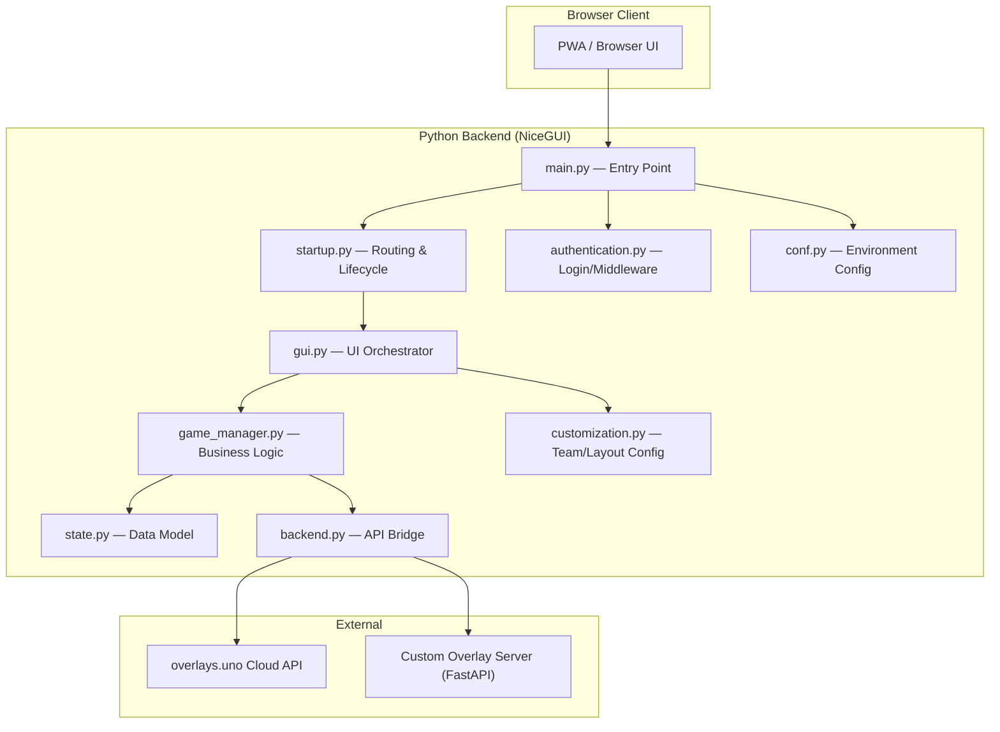

# Remote Scoreboard — Analysis & Future Improvements

## Project Overview

**Volley Overlay Control** is a Python/NiceGUI web app for controlling volleyball scoreboards via overlays.uno or custom overlay servers. It supports multi-user auth, PWA, multiple game modes (Indoor/Beach), dark mode, i18n (EN/ES), and Docker deployment.

---

## Architecture Summary

---

## Documentation Improvements Made

### [README.md](file:///c:/source/git/remote-scoreboard/README.md)
- Added **Contributing** section with guidelines for PRs and issue reporting
- Added **License** section (Apache 2.0, was only a badge before)
- Added missing `REMOTE_CONFIG_URL` and `APP_DEFAULT_LOGO` details to the config table
- Added **Troubleshooting** section with common issues
- Added **Changelog / Versioning** note

### [DEVELOPER_GUIDE.md](file:///c:/source/git/remote-scoreboard/DEVELOPER_GUIDE.md)
- Converted from plain text headings to proper Markdown formatting (`#`, `##`, `###`)
- Added a proper document title and description header
- Wrapped all class/method names in backticks for readability
- Added a new section for **Testing** (commands, conventions, CI pipeline)
- Added a **Dependency Overview** section listing key packages
- Added a proper code block for the directory tree structure
- Added links between documents (cross-referencing README and CUSTOM_OVERLAY)
- Added **Environment Setup** quick start for developers

### [CUSTOM_OVERLAY.md](file:///c:/source/git/remote-scoreboard/CUSTOM_OVERLAY.md)
- Minor formatting and consistency improvements
- Added a **Quick Start Checklist** summary at the top
- Added a note about the `.web/` reference implementation

---

## Future Improvement Suggestions

### 🔴 High Priority

| # | Suggestion | Rationale |
|---|-----------|-----------|
| 1 | **Pin all dependency versions** in [requirements.txt](file:///c:/source/git/remote-scoreboard/requirements.txt) | Only `nicegui` is pinned. `requests`, `python-dotenv`, `pytest`, etc. are unpinned — could cause breakage on updates. |
| 2 | **Separate dev/test dependencies** | `pytest`, `pytest-asyncio`, `pytest-selenium` are runtime [requirements.txt](file:///c:/source/git/remote-scoreboard/requirements.txt) entries but belong in `requirements-dev.txt` or similar. |
| 3 | **Add a `CONTRIBUTING.md`** | The project has CI/CD, Docker publishing, and growing complexity — contribution guidelines would help external contributors. |
| 4 | **Multi-stage Docker build** | Current [Dockerfile](file:///c:/source/git/remote-scoreboard/Dockerfile) copies entire repo (4 lines). A multi-stage build would reduce image size and avoid shipping test files, `.git`, etc. |
| 5 | **Fix [docker-compose.yml](file:///c:/source/git/remote-scoreboard/docker-compose.yml) variable mismatch** | Line 40 maps `DISABLE_OVERVIEW` ← `SHOW_PREVIEW` (inverted logic). The README documents `SHOW_PREVIEW` but [conf.py](file:///c:/source/git/remote-scoreboard/app/conf.py) reads `DISABLE_OVERVIEW`. This is confusing. |

### 🟡 Medium Priority

| # | Suggestion | Rationale |
|---|-----------|-----------|
| 6 | **Add `.dockerignore`** | No `.dockerignore` exists — Docker builds copy `__pycache__`, `.git`, `screenshots`, `node_modules` (.web), etc. into the image. |
| 7 | **Add type hints** across the codebase | Files like [conf.py](file:///c:/source/git/remote-scoreboard/app/conf.py), [game_manager.py](file:///c:/source/git/remote-scoreboard/app/game_manager.py), and [backend.py](file:///c:/source/git/remote-scoreboard/app/backend.py) lack type annotations, making IDE support weaker. |
| 8 | **Extract hardcoded strings** to [Messages](file:///c:/source/git/remote-scoreboard/app/messages.py#4-151) class | Some UI strings in [gui.py](file:///c:/source/git/remote-scoreboard/app/gui.py), [customization_page.py](file:///c:/source/git/remote-scoreboard/app/customization_page.py), and dialog files are still hardcoded rather than going through `Messages.get()`. |
| 9 | **Add code coverage** to CI | The CI pipeline runs tests but doesn't report coverage. Adding `pytest-cov` would help track test quality. |
| 10 | **Clean up empty directories** | `assets/`, `bin/`, `.states/`, and `test/` are empty and serve no purpose in the current codebase. |
| 11 | **Add more languages** | i18n supports only EN/ES. The [Messages](file:///c:/source/git/remote-scoreboard/app/messages.py#4-151) pattern could be extended to support PT, FR, IT, DE, etc. — common for volleyball communities globally. |
| 12 | **Add `CHANGELOG.md`** | The README mentions a breaking v0.2 change but there's no formal changelog tracking version history. |
| 13 | **[.gitignore](file:///c:/source/git/remote-scoreboard/.gitignore) has duplicate entry** | Line 5 and 6 both have `/data`. Minor, but should be cleaned up. |

### 🟢 Nice to Have

| # | Suggestion | Rationale |
|---|-----------|-----------|
| 14 | **Add health check endpoint** | A `/health` or `/api/status` endpoint would help Docker health checks and monitoring. |
| 15 | **WebSocket support for real-time sync** | Currently uses HTTP polling — WebSocket would reduce latency for multi-user scenarios. |
| 16 | **Modularize [gui.py](file:///c:/source/git/remote-scoreboard/app/gui.py)** | At 37KB / ~1000 lines, [gui.py](file:///c:/source/git/remote-scoreboard/app/gui.py) is the largest file and could benefit from further decomposition. |
| 17 | **Add pre-commit hooks** | Standardize linting (flake8) and formatting before PRs, matching what the CI already runs. |
| 18 | **Configuration validation** | Add startup validation for env vars (e.g., ensure `MATCH_GAME_POINTS` is a positive integer, JSON vars are valid). |
| 19 | **API documentation** | Auto-generate API docs for the custom overlay contract (e.g., OpenAPI spec). |
| 20 | **Mobile-optimized testing** | Add Playwright mobile viewport tests given the PWA target. |
